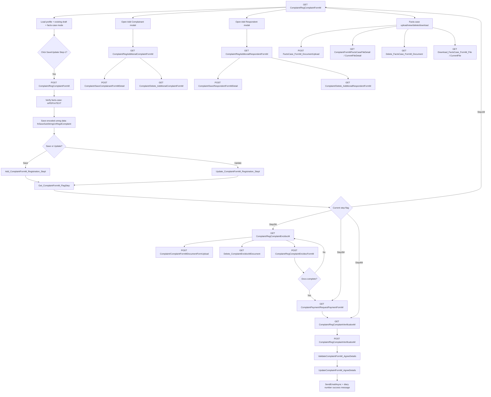

# Form-M Debug Artifacts

## Compact Debug Table

See: `formm-debug-table.md`

## Flowchart (Mermaid)

```mermaid
flowchart TD
    A["GET Complaint/RegComplaintFormM"] --> B["Load profile + existing draft + facts-case mode"]
    B --> C{"Click Save/Update Step-1?"}
    C -->|Yes| D["POST Complaint/RegComplaintFormM"]
    D --> E["Verify facts-case: mPDF/mTEXT"]
    E --> F["Save encoded unreg data: fnSaveSubStringUnRegdComplaint"]
    F --> G{"Save or Update?"}
    G -->|Save| H["Add_ComplaintFormM_Registration_StepI"]
    G -->|Update| I["Update_ComplaintFormM_Registration_StepI"]
    H --> J["Get_ComplaintFormM_FlagStep"]
    I --> J
    J --> K{"Current step flag"}
    K -->|Step1M| A
    K -->|Step2M| L["GET Complaint/RegComplaintEncldocM"]
    K -->|Step3M| M["GET ComplaintPayment/RequestPaymentFormM"]
    K -->|Step4M| N["GET Complaint/RegComplaintVerificationM"]

    A --> O["Open Add Complainant modal"]
    O --> P["GET Complaint/RegAdditionalComplaintFormM"]
    P --> Q["POST Complaint/SaveComplainantFormMDetail"]
    P --> R["GET Complaint/Delete_AdditionalComplaintFormM"]

    A --> S["Open Add Respondent modal"]
    S --> T["GET Complaint/RegAdditionalRespondentFormM"]
    T --> U["POST Complaint/SaveRespondentFormMDetail"]
    T --> V["GET Complaint/Delete_AdditionalRespondentFormM"]

    A --> W["Facts-case upload/view/delete/download"]
    W --> W1["POST FactsCase_FormM_DocumentUpload"]
    W --> W2["GET ComplaintFormMFactsCaseFileDetail / CurrentFileDetail"]
    W --> W3["GET Delete_FactsCase_FormM_Document"]
    W --> W4["GET Download_FactsCase_FormM_File / CurrentFile"]

    L --> X["POST Complaint/ComplaintFormMDocumentFormUpload"]
    L --> Y["GET Delete_ComplaintEncldocMDocument"]
    L --> Z["POST Complaint/RegComplaintEncldocFormM"]
    Z --> Z1{"Docs complete?"}
    Z1 -->|No| L
    Z1 -->|Yes| M

    M --> N
    N --> AA["POST Complaint/RegComplaintVerificationM"]
    AA --> AB["ValidateComplaintFormM_AgreeDetails"]
    AB --> AC["UpdateComplaintFormM_AgreeDetails"]
    AC --> AD["SendEmailAsync + diary number success message"]
```
